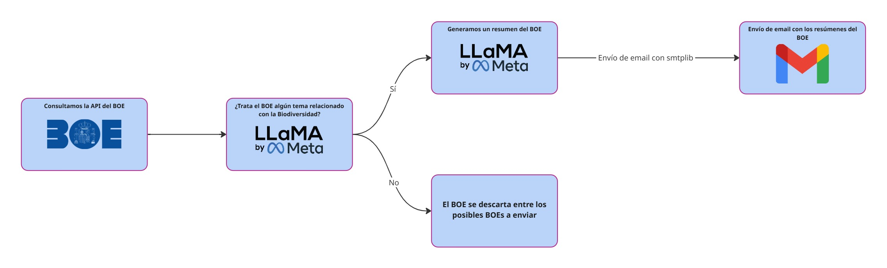

<h1 align="center">Sistema de Alerta de cambios en BOE sobre Biodiversidad</h1>

<p align="center">
  
</p>


**Solución presentada para el Hackathon "Soluciones GenAI para la Biodiversidad" de Algoritmos Verdes.**
[](https://algoritmosverdes.gob.es/es/hackathon/soluciones-genai-para-la-biodiversidad)

<details>
<summary>Tabla de Contenidos</summary>

- [1. El Reto: Problema de Biodiversidad](#1-el-reto-problema-de-biodiversidad)
  - [Relevancia 💡](#relevancia-)
  - [Ineficiencia Actual ⏳](#ineficiencia-actual-)
- [2. Nuestra Solución :rocket:](#2-nuestra-solución-rocket)
  - [2.1 Descripción General](#21-descripción-general)
- [3. Características Principales 🛠️](#3-características-principales-️)
- [4. Demo / Presentación](#4-demo--presentación)
- [5. Stack Tecnológico 🧑‍💻](#5-stack-tecnológico-)
- [6. LLM - Utilizados](#6-llm---utilizados)
- [7. Fuentes de Datos 🗂️](#7-fuentes-de-datos-️)
- [8. Instalación ⚙️](#8-instalación-️)
- [9. Uso ▶️](#9-uso-️)

</details>

## 1. El Reto: Problema de Biodiversidad 

### Relevancia 💡
Mantenerse al día con la legislación sobre biodiversidad publicada en boletines oficiales (como el BOE) es crucial para la conservación, la investigación y la gestión ambiental en España. Sin embargo, el volumen y la frecuencia de las publicaciones hacen que el seguimiento manual sea una tarea ingente y propensa a retrasos.

### Ineficiencia Actual ⏳
La principal dificultad radica en la necesidad de revisar manualmente extensos documentos oficiales para identificar, interpretar y resumir las secciones relevantes para la biodiversidad. Este proceso consume mucho tiempo y recursos, ralentizando la capacidad de respuesta y la toma de decisiones informadas por parte de administraciones, empresas y centros de investigación.


## 2. Nuestra Solución :rocket:
### 2.1 Descripción General 
Esta solución se conecta con la API del BOE, consulta de forma diaria los boletines de los ministerios y departamentos previamente configurados, y extrae todos sus documentos publicados. Una vez extraídos y clasificados se genera un resumen para cada uno de ellos y se envían por email al usuario.
   
*   **Enfoque GenAI:** 
    *   Clasificación binaria: Cada disposición extraída se pasa por un modelo instructivo el cual incluye dicho BOE si la información está relacionada con biodiversidad y descarta en caso contrario.

    *   Filtrado por departamentos: Sólo procesamos los boletines de los organismos que interesan (Medio Ambiente, Ciencia, Agricultura, …) de aquellos departamentos que publiquen BOEs relacionados con la temática de la Biodiversidad.

    *   Resumen automático: Para cada documento relacionado con la temática, el LLM genera un resumen con los puntos claves que se tratan en cada BOE.


## 3. Características Principales 🛠️

*   Funcionalidades clave
    *   **API del BOE**: Extracción automática de los sumarios publicados por los Ministerios seleccionados.

    *   **Clasificación binaria**: LLM que etiqueta cada BOE en función de su relación con la biodiversidad.

    *   **Extracción de los puntos claves y resumen**: Resumen de 3–4 frases del contenido del BOE con los puntos claves

    *  **Notificación**: Envío de notificación por email con los resúmenes de los diferentes sumarios relacionados con Biodiversidad.

 > Metodología seguida

 <p align="center">
  
</p>

## 4. Demo / Presentación
  
*   Enlace a un vídeo corto mostrando la aplicación en funcionamiento.
*   Enlace a la presentación de diapositivas (si la hay).

## 5. Stack Tecnológico 🧑‍💻

*   **Lenguajes:** Python.
*   **Frameworks/Librerías Principales:** Langchain, Ollama ,Transformers y CodeCarbon.
*   **Modelos GenAI Utilizados durante el desarrollo:**  
    *   `Salamandra-7B`,
    *   `Salamandra-7B-instruct`
    *   `Salamandra-7B-instruct-fp8`
    *   `Salamandra-2B-instruct`
    *   `gemma-3-4b-it`
    *   `Mistral-7B-Instruct-v0.3`
    *   `Ministral-8B-Instruct-2410`
    *   `llama3.1:8b-instruct`
    *   `llama3.1:8b-instruct-q4_K_M`
*   **Infraestructura:**: Máquina Virtual desplegada en Azure. En concreto `Standard D8as v5 (8 vcpus, 32 GiB memory)` sin GPU.

## 6. LLM - Utilizados
Para las tareas de clasificación de relevancia y generación de resúmenes de los documentos del BOE, se optó finalmente por un modelo de la familia Llama 3.1, específicamente una versión cuantizada de 8B.
*   **Descarte de la familia Salamandra**: Durante una parte importante del desarrollo se utilizó el modelo Salamandra-7B. No obstante, se detectaron varias limitaciones relevantes que supusieron un cuello de botella durante el desarrollo y por tanto, una búsqueda de LLM alternativo. Las limitaciones fueron las siguientes:
    
    * <u>Respuestas en idiomas no esperados</u>:
    A pesar de especificar el español tanto en los prompts como en los documentos, el modelo generaba respuestas en otras lenguas cooficiales como el catalán, afectando la coherencia lingüística.

    * <u>Ventana de Contexto limitada</u>: Esta restricción dificultaba el procesamiento de documentos BOE medianamente largos (a partir de 6–7 páginas), lo que obligó a implementar estrategias adicionales de partición (splitting) y segmentación (chunking). Otros modelos de tamaño equivalente ya permiten ventanas de 32K o incluso 128K tokens.

    * <u>Inconsistencia en las respuestas</u>: Incluso aplicando técnicas de prompt engineering, el modelo no generaba respuestas homogéneas. Se observaron variaciones arbitrarias entre documentos similares, salidas no estandarizadas e incluso frases fuera de contexto o en otro idioma. Cabe destacar que los mismos prompts, al ser probados con modelos de las familias Mistral y LLaMA, ofrecieron resultados notablemente más consistentes y alineados con lo esperado.

*   **Elección del Modelo (Llama 3.1 8B):**
    *   <u>Rendimiento Superior:</u> Durante el desarrollo, se evaluaron diferentes modelos (enumerados anteriormente), optando en primer lugar por los de la familia Salamandra . Sin embargo, sus respuestas y capacidad para clasificar con precisión los documentos del BOE y generar resúmenes coherentes no alcanzaron el nivel de calidad deseado para este proyecto.
  
    *   <u>Capacidad de Seguir Instrucciones y Calidad de Generación:</u> Los modelos Llama 3.1, incluso en sus versiones de 8B parámetros, demostraron una mejor comprensión de las instrucciones (*prompts*) y una calidad mucho mayor en la generación de texto en español, resultando más efectivos para las tareas de clasificación y resumen requeridas.
  

*   **Consideraciones sobre Fine-tuning, RAG y TAG:**
    Tras analizar nuestra solución y considerar las diferentes técnicas a aplicar se tomaron las siguientes medidas:
    *   <u>*Fine-tuning*</u>: No se realizó un *fine-tuning* específico. Se priorizó la selección de un modelo base con un buen rendimiento *zero-shot* o *few-shot* (como Llama 3.1) con soporte de `Tool Calling` y la optimización a través de *prompt engineering*. Evitando de esta forma generar consumo durante las largas fases de entrenamiento de los LLM.
  
    *   <u>*Retrieval Augmented Generation* (RAG):</u> Para la clasificación y resumen de documentos autocontenidos del BOE, el enfoque directo con un modelo instructivo como Llama 3.1, proporcionando el texto del BOE en el *prompt*, fue suficiente. No se requirió un sistema RAG para consultar bases de conocimiento externas.
  
    *   <u>*Table Augmented Generation (TAG):*</u> No se identificó la necesidad de que el LLM utilizara TAG debido a que la obtención de datos se hacía a través de la API o por Requests.

*   **Técnicas de Optimización para LLM:** 
   >**WIP ARTURO**
    * <u>Prompt Engineering:</u> Se invirtió esfuerzo en el diseño, refinamiento y optimización de *prompts* claros y efectivos para guiar al modelo Llama 3.1 en las tareas de clasificación y resumen, con el objetivo de maximizar la calidad de las respuestas y minimizar ambigüedades e inconsistencias. Estos prompts están disponibles en `internal\llm_utils.py`. Por ejemplo, el prompt para resumir es:
    *   <u>Ejecución Local con:**
        *   Ollama</u> El uso de Ollama facilitó la gestión y ejecución del modelo LLM en la VM.
        *   Transformers
    *   *  *   <u>Recursos y Viabilidad:</u> Se utiliza una versión cuantizada a 4 bits del modelo Llama 3.1 8B. La cuantización es crucial para reducir significativamente el tamaño del modelo, los requisitos de memoria y cómputo durante la inferencia manteniendo un rendimiento similar al modelo sin cuantizar.**

## 7. Fuentes de Datos 🗂️
*   **Fuente Principal de Datos en Tiempo Real:**
    *   La solución utiliza la **API de Datos Abiertos del Boletín Oficial del Estado (BOE)** para acceder y descargar diariamente los sumarios y documentos publicados.
    *   Referencia API: [https://boe.es/datosabiertos/api/api.php](https://boe.es/datosabiertos/api/api.php)

*   **Creación de Conjunto de Datos para Desarrollo y Pruebas:**
    *   Para el desarrollo inicial, la validación de los *prompts* y las pruebas del sistema, se recopiló un conjunto de datos manualmente.
    *   Este conjunto se generó a partir de la descarga de documentos del BOE de diferentes días y secciones, seleccionando ejemplos relevantes e irrelevantes para la temática de biodiversidad.
    *   Ejemplo de consulta diaria de BOEs: [https://boe.es/boe/dias/2025/05/20/](https://boe.es/boe/dias/YYYY/MM/DD/) (reemplazar YYYY/MM/DD por fechas específicas).
    *   Este conjunto de datos ayudó a refinar los criterios de clasificación y la efectividad de los resúmenes generados por el LLM antes de la implementación del flujo automatizado con la API.


## 8. Instalación ⚙️

Siga estos pasos para configurar el entorno y ejecutar el proyecto:

1.  **Clonar el Repositorio (si aún no lo ha hecho):**
    ```bash
    git clone <URL_DEL_REPOSITORIO>
    cd <NOMBRE_DEL_DIRECTORIO_DEL_PROYECTO>
    ```

2.  **Crear un Entorno Virtual (Recomendado):**
    ```bash
    python -m venv venv
    ```
    Para activar el entorno virtual:
    *   En Windows:
        ```bash
        .\venv\Scripts\activate
        ```
    *   En macOS/Linux:
        ```bash
        source venv/bin/activate
        ```

3.  **Instalar las Dependencias del Proyecto:**
    Asegúrese de tener el entorno virtual activado.
    ```bash
    pip install -r requirements.txt
    ```

4.  **Instalar Ollama:**
    *   Si aún no tiene Ollama instalado, descárguelo e instálelo desde el sitio web oficial: [https://ollama.com/download](https://ollama.com/download). Siga las instrucciones para su sistema operativo (Windows, macOS o Linux).
    *   Después de la instalación, asegúrese de que el servicio de Ollama se esté ejecutando. Generalmente se inicia automáticamente.

5.  **Descargar el Modelo LLM con Ollama:**
    Abra una terminal o línea de comandos y ejecute el siguiente comando para descargar el modelo `llama3.1:8b-instruct` (o la versión cuantizada específica que esté utilizando, por ejemplo, `q4_K_M`):
    ```bash
    ollama pull llama3.1:8b-instruct
    ```
    O si usa una versión cuantizada específica, por ejemplo:
    ```bash
    ollama pull llama3.1:8b-instruct-q4_K_M
    ```
    Espere a que la descarga se complete. El tamaño del modelo puede ser considerable.

6.  **Configurar Destinatarios (Ver sección de Uso):**
    Asegúrese de crear y configurar el archivo `destinatarios.json` como se indica en la sección "Uso".

*   Instalamos las dependencias del proyecto:
    ```bash
    pip install -r requirements.txt
    ```
## 9. Uso ▶️
Para poder ejecutar el proceso es necesario seguir los siguientes pasos:
- Incluir los correos de los destinatarios deseados en el archivo destinatarios.json en formato json.
- Incluir los departamentos deseados en el archivo de target_depts.json
- Para cambiar la fecha el usuario debe dirigirse al archivo main.py. Este encontrará una variable con el nombre de sumario la cual tiene el valor de una función: get_boe_sumario(). En caso de dejarla vacía se ejecutará el proceso con la fecha del día actual, para seleccionar una fecha concreta el usuario debe incluir como argumento de la función lo siguiente: fecha="YYYYMMDD".
- Para correr la solución:

    ```bash
    python main.py
    ```