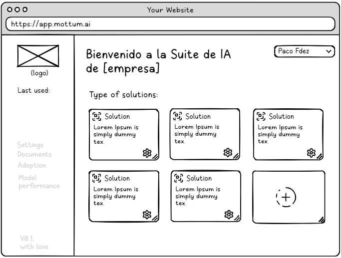
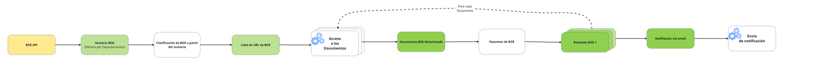

<h1 align="center">Sistema de Alerta de cambios en BOE sobre Biodiversidad</h1>

<p align="center">
  
</p>


**Solución presentada para el Hackathon "Soluciones GenAI para la Biodiversidad" de Algoritmos Verdes.**
[](https://algoritmosverdes.gob.es/es/hackathon/soluciones-genai-para-la-biodiversidad)

<details>
<summary>Índice</summary>

- [1. El Reto: Problema de Biodiversidad](#1-el-reto-problema-de-biodiversidad)
  - [1.1 Relevancia 💡](#11-relevancia-)
  - [1.2 Ineficiencia Actual ⏳](#12-ineficiencia-actual-)
- [2. Nuestra Solución :rocket:](#2-nuestra-solución-rocket)
  - [2.1 Descripción General](#21-descripción-general)
  - [2.2 Escalabilidad a Producto](#22-escalabilidad-a-producto)
- [3. Características Principales 🛠️](#3-características-principales-️)
- [4. Stack Tecnológico 🧑‍💻](#4-stack-tecnológico-)
- [5. LLM - Utilizados](#5-llm---utilizados)
- [6. Fuentes de Datos 🗂️](#6-fuentes-de-datos-️)
- [7. Instalación ⚙️](#7-instalación-️)
- [8. Uso ▶️](#8-uso-️)
- [9. Licencia 📄](#9-licencia-)
- [10. Autores](#10-autores)
- [11. Sobre Mottum](#11-sobre-mottum)

</details>

## 1. El Reto: Problema de Biodiversidad 

### 1.1 Relevancia 💡
Mantenerse al día con la legislación sobre biodiversidad publicada en boletines oficiales (como el BOE) es crucial para la conservación, la investigación y la gestión ambiental en España. Sin embargo, el volumen y la frecuencia de las publicaciones hacen que el seguimiento manual sea una tarea ingente y propensa a retrasos.

### 1.2 Ineficiencia Actual ⏳
La principal dificultad radica en la necesidad de revisar manualmente extensos documentos oficiales para identificar, interpretar y resumir las secciones relevantes para la biodiversidad. Este proceso consume mucho tiempo y recursos, ralentizando la capacidad de respuesta y la toma de decisiones informadas por parte de administraciones, empresas y centros de investigación.

## 2. Nuestra Solución :rocket:
### 2.1 Descripción General 
Esta solución se conecta con la API del BOE, consulta de forma diaria los boletines de los ministerios y departamentos previamente configurados, y extrae todos sus documentos publicados. Una vez extraídos y clasificados se genera un resumen para cada uno de ellos y se envían por email al usuario.
   
*   **Enfoque GenAI:** 
    *   Clasificación binaria: Cada disposición extraída se pasa por un modelo instructivo el cual incluye dicho BOE si la información está relacionada con biodiversidad y descarta en caso contrario.

    *   Filtrado por departamentos: Sólo procesamos los boletines de los organismos que interesan (Medio Ambiente, Ciencia, Agricultura, …) de aquellos departamentos que publiquen BOEs relacionados con la temática de la Biodiversidad.

    *   Resumen automático: Para cada documento relacionado con la temática, el LLM genera un resumen con los puntos claves que se tratan en cada BOE.

### 2.2 Escalabilidad a Producto
<p align="center">
  
</p>

No todas las necesidades de IA son iguales para todos nuestros clientes. Por eso, presentamos una Suite de IA Flexible y Modular, la cual permite diseñar y construir las soluciones que tu organización requiere. Ya sea que necesites agentes especializados, sistemas de búsqueda semántica con RAG, o asistentes enfocados a tu caso de uso, nuestra plataforma te ofrece la libertad y el control para crear tu estrategia de IA.

*   **Mottum.AI:** 
    *   Optimización de Procesos y Productividad: Permite la automatización tareas repetitivas, la agilización flujos de trabajo y libera a tus equipos para que se concentren en iniciativas estratégicas mediante la creación de agentes inteligentes y asistentes virtuales adaptados las necesidades de la organización.
    *   Acceso Inteligente a la Información: Los datos son necesarios. Implementa soluciones de RAG para que tus empleados y clientes obtengan respuestas precisas y contextualizadas.
    *   Innovación Acelerada: Reduce la complejidad y los tiempos de desarrollo. Nuestra suite proporciona los bloques de construcción y la flexibilidad para prototipar, construir y desplegar soluciones de IA de una manera rápida y eficiente.
    *   Flexibilidad y escalabilidad: Comienza con soluciones específicas y escala a medida que tus necesidades evolucionan.
    *   Reducción de Costos Operativos: Al automatizar procesos, mejorar la eficiencia de los empleados y optimizar la utilización de recursos, nuestras soluciones de IA pueden contribuir significativamente a la reducción de costos operativos.
    *   Gobernanza: Nuestra suite facilita la implementación de soluciones personalizables, facilita el seguimiento de rendimiento de los modelos, y permite a perfiles menos técnicos ser capaces de implementar sus propias soluciones de IA, ofreciendo transparecia y autonomía para cualquier perfil.

## 3. Características Principales 🛠️

*   A continuación, se describen las funcionalidades clave incorporadas, y el diagrama que sigue ilustra visualmente los procesos.
    *   **API del BOE**: Extracción automática de los sumarios publicados por los Ministerios seleccionados.

    *   **Clasificación binaria**: LLM que etiqueta cada BOE en función de su relación con la biodiversidad.

    *   **Extracción de los puntos claves y resumen**: Resumen del contenido del BOE con los puntos claves

    *  **Notificación**: Envío de notificación por email con los resúmenes de los diferentes sumarios relacionados con Biodiversidad.


 <p align="center">
  
</p>

## 4. Stack Tecnológico 🧑‍💻

*   **Lenguajes:** Python.
*   **Frameworks/Librerías Principales:** Langchain, Ollama ,Transformers y CodeCarbon.
*   **Modelos GenAI Utilizados durante el desarrollo:**  
    *   `Salamandra-7B`,
    *   `Salamandra-7B-instruct`
    *   `Salamandra-7B-instruct-fp8`
    *   `Salamandra-2B-instruct`
    *   `gemma-3-4b-it`
    *   `Mistral-7B-Instruct-v0.3`
    *   `Ministral-8B-Instruct-2410`
    *   `llama3.1:8b-instruct`
    *   `llama3.1:8b-instruct-q4_K_M`
*   **Infraestructura:**: Máquina Virtual desplegada en Azure. En concreto `Standard D8as v5 (8 vcpus, 32 GiB memory)` sin GPU.

## 5. LLM - Utilizados
Para las tareas de clasificación de relevancia y generación de resúmenes de los documentos del BOE, se optó finalmente por un modelo de la familia Llama 3.1, específicamente una versión cuantizada de 8B.
*   **Descarte de la familia Salamandra**: Durante una parte importante del desarrollo se utilizó el modelo Salamandra-7B. No obstante, se detectaron varias limitaciones relevantes que supusieron un cuello de botella durante el desarrollo y por tanto, una búsqueda de LLM alternativo. Las limitaciones fueron las siguientes:
    
    * <u>Respuestas en idiomas no esperados</u>:
    A pesar de especificar el español tanto en los prompts como en los documentos, el modelo generaba respuestas en otras lenguas cooficiales como el catalán, afectando la coherencia lingüística.

    * <u>Ventana de Contexto limitada</u>: Esta restricción dificultaba el procesamiento de documentos BOE medianamente largos (a partir de 6–7 páginas), lo que obligó a implementar estrategias adicionales de partición (splitting) y segmentación (chunking). Otros modelos de tamaño equivalente ya permiten ventanas de 32K o incluso 128K tokens.

    * <u>Inconsistencia en las respuestas</u>: Incluso aplicando técnicas de prompt engineering, el modelo no generaba respuestas homogéneas. Se observaron variaciones arbitrarias entre documentos similares, salidas no estandarizadas e incluso frases fuera de contexto o en otro idioma. Cabe destacar que los mismos prompts, al ser probados con modelos de las familias Mistral y LLaMA, ofrecieron resultados notablemente más consistentes y alineados con lo esperado.

*   **Elección del Modelo (Llama 3.1 8B):**
    *   <u>Rendimiento Superior:</u> Durante el desarrollo, se evaluaron diferentes modelos (enumerados anteriormente), optando en primer lugar por los de la familia Salamandra . Sin embargo, sus respuestas y capacidad para clasificar con precisión los documentos del BOE y generar resúmenes coherentes no alcanzaron el nivel de calidad deseado para este proyecto.
  
    *   <u>Capacidad de Seguir Instrucciones y Calidad de Generación:</u> Los modelos Llama 3.1, incluso en sus versiones de 8B parámetros, demostraron una mejor comprensión de las instrucciones (*prompts*) y una calidad mucho mayor en la generación de texto en español, resultando más efectivos para las tareas de clasificación y resumen requeridas.
  

*   **Consideraciones sobre Fine-tuning, RAG y TAG:**
    Tras analizar nuestra solución y considerar las diferentes técnicas a aplicar se tomaron las siguientes medidas:
    *   <u>*Fine-tuning*</u>: No se realizó un *fine-tuning* específico. Se priorizó la selección de un modelo base con un buen rendimiento *zero-shot* o *few-shot* (como Llama 3.1) con soporte de `Tool Calling` y la optimización a través de *prompt engineering*. Evitando de esta forma generar consumo durante las largas fases de entrenamiento de los LLM.
  
    *   <u>*Retrieval Augmented Generation* (RAG):</u> Para la clasificación y resumen de documentos autocontenidos del BOE, el enfoque directo con un modelo instructivo como Llama 3.1, proporcionando el texto del BOE en el *prompt*, fue suficiente. No se requirió un sistema RAG para consultar bases de conocimiento externas.
  
    *   <u>*Table Augmented Generation (TAG):*</u> No se identificó la necesidad de que el LLM utilizara TAG debido a que la obtención de datos se hacía a través de la API o por Requests.

*   **Técnicas de Optimización para LLM:** 
   
    * <u>Prompt Engineering:</u> Se invirtió esfuerzo en el diseño, refinamiento y optimización de *prompts* claros y efectivos para guiar al modelo Llama 3.1 en las tareas de clasificación y resumen, con el objetivo de maximizar la calidad de las respuestas y minimizar ambigüedades e inconsistencias. Estos prompts están disponibles en `internal\llm_utils.py`. Por ejemplo, el prompt para resumir es:
  
        ```
        Role (Rol)
        Eres un experto legal especializado en legislación española vinculada a la biodiversidad, por tanto DEBES RESPONDER EN ESPAÑOL. 

        Tienes experiencia analizando disposiciones del Boletín Oficial del Estado (BOE) con un enfoque particular en normas que afectan al medio ambiente, la conservación de la naturaleza y la protección de especies o hábitats.

        Instructions (Instrucciones)
            Analiza el texto completo de un BOE proporcionado y realiza las siguientes tareas:
            Identificación temática:
                Determina si la disposición está relacionada directa o indirectamente con la biodiversidad (conservación, restauración ambiental, especies protegidas, espacios naturales, etc.).
                    
                Si no está relacionada, indícalo claramente al inicio y concluye el análisis.
                Extracción de puntos clave (solo si el BOE sí está relacionado):
                    Metadatos básicos:
                        Número de BOE y fecha de publicación.
                        Tipo de disposición (Ley, Real Decreto, Orden Ministerial, etc.).
                        Órgano emisor.
                    Objeto y alcance:
                        Breve descripción del propósito de la norma.
                        Ámbito territorial y sectores afectados.
                    Contenido esencial:
                        Artículos que implican cambios legislativos, nuevos marcos regulatorios o medidas específicas sobre biodiversidad.
                        Obligaciones, limitaciones, incentivos o sanciones relevantes.
                        Fechas clave (entrada en vigor, plazos de cumplimiento).
                    Impacto ambiental:
                        Medidas de conservación, restauración ecológica o protección ambiental.
                        Referencias a espacios protegidos (Red Natura 2000, ZEPAs, LICs) o a especies específicas.
                    Resumen ejecutivo:
                        En 2-3 frases, describe la relevancia de la disposición y su impacto sobre la biodiversidad o el medio natural.


            Context (Contexto)
                Este asistente será utilizado para revisar disposiciones legales publicadas en el BOE, con el fin de detectar y sintetizar aquellas que impactan la legislación sobre biodiversidad. No todos los textos estarán relacionados con esta temática, por lo que también debe actuar como filtro.

            Constraints (Restricciones)
                Longitud máxima: 150 palabras.
                Redacción en un único párrafo, sin espacios ni saltos de línea.
                No interpretar ni especular más allá de lo que dice el texto.
                Si el texto no tiene relación con la biodiversidad, dejarlo claro y no continuar con el análisis.
                Enfocar el análisis en medidas que introduzcan o modifiquen obligaciones legales, protecciones, restricciones o impactos sobre ecosistemas.
            
            Ejemplos:
                A continuación recibirás el contenido completo de una disposición legal publicada en el Boletín Oficial del Estado (BOE).
                Deberás analizarla según las instrucciones proporcionadas previamente para determinar su relación con la biodiversidad y extraer un resumen estructurado.
                Los campos requeridos en la respuesta son: Título, URL, Resumen (RESUMEN CON LOS PUNTOS CLAVE SOBRE LOS CAMBIOS RELACIONADOS CON BIODIVERSIDAD).
                
                Ejemplo de respuesta tras analizar TODO un BOE:
                Título: Resolución de 13 de enero de 2025, de la Dirección General de Biodiversidad, Bosques y Desertificación, sobre modificación de ZEPAs marinas en la RAMPE. 
                URL: https://www.boe.es/diario_boe/txt.php?id=BOE-A-2025-1299
                Resumen: Se integra en la Red de Áreas Marinas Protegidas de España (RAMPE) dos nuevas ZEPAs marinas (ES0000554 y ESZZ12004) y se suprimen seis anteriores por absorción territorial. La disposición responde al artículo 6 del Real Decreto 1599/2011, modificando delimitaciones y ajustando la red a criterios UICN de categoría IV. El objetivo es reforzar la protección de corredores migratorios de aves y mejorar la coherencia ecológica de la Red Natura 2000 en aguas españolas, especialmente en Galicia y Cádiz.

            Texto completo del BOE:  
            \"\"\"  
            {document}
            \"\"\"

            """
        ```
 
    *  <u>Ejecución Local</u>:
          * `Ollama`: nos sirvió como backend principal para la inferencia de modelos LLM, permitiendo desplegar y gestionar modelos de lenguaje de manera local con una configuración mínima. Gracias a su sencillez, fue posible contar rápidamente con un servicio de inferencia funcional, facilitando el desarrollo y las pruebas. Sin embargo, fue necesario ajustar su configuración para evitar que el servicio quedara ejecutándose en segundo plano y consumiendo recursos del sistema de forma innecesaria cuando no se utilizaba.

        * `Transformers`: También se implementó una versión completamente funcional basada en la librería Transformers de Hugging Face. Aunque su integración requirió un mayor esfuerzo inicial en cuanto a instalación y gestión de dependencias, este trabajo se vio recompensado por la eficiencia y flexibilidad obtenidas en la ejecución local de los modelos. En el código actual, la opción de Transformers está comentada, pero puede activarse fácilmente si se prefiere este enfoque.
       * Recursos y Viabilidad: Se utiliza una versión cuantizada a 4 bits del modelo Llama 3.1 8B. La cuantización es crucial para reducir significativamente el tamaño del modelo, los requisitos de memoria y cómputo durante la inferencia manteniendo un rendimiento levemente inferior al modelo sin cuantizar.

## 6. Fuentes de Datos 🗂️
*   **Fuente Principal de Datos en Tiempo Real:**
    *   La solución utiliza la **API de Datos Abiertos del Boletín Oficial del Estado (BOE)** para acceder y descargar diariamente los sumarios y documentos publicados.
    *   Referencia API: [https://boe.es/datosabiertos/api/api.php](https://boe.es/datosabiertos/api/api.php)

*   **Creación de Conjunto de Datos para Desarrollo y Pruebas:**
    *   **Creación de Conjunto de Datos para Desarrollo y Pruebas:**
        *   Para el desarrollo inicial y la validación de *prompts*, se compiló manualmente un conjunto de datos. Este consistió en documentos del BOE de diversas fechas, secciones y formatos, incluyendo ejemplos tanto relevantes como irrelevantes para la biodiversidad.
        *   Se utilizó como referencia la estructura de consulta diaria del BOE, por ejemplo: `https://boe.es/boe/dias/YYYY/MM/DD/` (donde `YYYY/MM/DD` se reemplaza por la fecha deseada).
        *   Este conjunto de datos fue fundamental para refinar los criterios de clasificación y la calidad de los resúmenes generados por el LLM antes de automatizar el proceso mediante la API.


## 7. Instalación ⚙️

Siga estos pasos para configurar el entorno y ejecutar el proyecto:

1.  **Clonar el Repositorio (si aún no lo ha hecho):**
    ```bash
    git clone https://github.com/MottumData/Alerta-BOE.git
    cd Alerta-BOE
    ```

2.  **Instalar las Dependencias del Proyecto:**
    Asegúrese de tener el entorno virtual activado.
    ```bash
    pip install -r requirements.txt
    ```

3.  **Instalar Ollama:**
    *   Si aún no tiene Ollama instalado, descárguelo e instálelo desde el sitio web oficial: [https://ollama.com/download](https://ollama.com/download). Siga las instrucciones para su sistema operativo (Windows, macOS o Linux).
    *   Después de la instalación, asegúrese de que el servicio de Ollama se esté ejecutando. Generalmente se inicia automáticamente.

4.  **Descargar el Modelo LLM con Ollama:**
    Abra una terminal o línea de comandos y ejecute el siguiente comando para descargar el modelo `llama3.1:8b-instruct` (o la versión cuantizada específica que esté utilizando, por ejemplo, `q4_K_M`):
    ```bash
    ollama pull llama3.1:8b-instruct
    ```
    O si usa una versión cuantizada específica, por ejemplo:
    ```bash
    ollama pull llama3.1:8b-instruct-q4_K_M
    ```
    Espere a que la descarga se complete. El tamaño del modelo puede ser considerable.

5.  **Configurar Destinatarios y los departamentos a los que consultar (Ver sección de Uso):**
    Asegúrese de crear y configurar el archivo `destinatarios.json` y `target_depts.json` como se indica en la sección "Uso".

## 8. Uso ▶️
Para poder ejecutar el proceso es necesario seguir los siguientes pasos:
1.  **Configurar los destinatarios:**
    Cree un archivo llamado `destinatarios.json` en la raíz del proyecto. Este archivo debe contener una lista de las direcciones de correo electrónico a las que se enviarán las notificaciones.
    Ejemplo de contenido para `destinatarios.json`:
    ```json
    {
        "receivers": [
          "correo1@ejemplo.com",
          "correo2@ejemplo.com"
        ]
    }
    ```

    > ℹ️ Las limitaciones actuales pueden afectar la
        entrega de correos electrónicos a direcciones corporativas.
        Está previsto que esto se solucione en una futura
        actualización.

    
2.  **Configurar los departamentos de interés:**
    Cree un archivo llamado `target_depts.json` en la raíz del proyecto (o en la carpeta `internal` si así lo configuró en `boe_utils.py`). Este archivo debe contener una lista de los nombres de los departamentos del BOE que desea monitorear.
    Ejemplo de contenido para `target_depts.json`:
    ```json
    {
        "target_depts": [
            "MINISTERIO ABC",
            "DIRECCIÓN GENERAL DE BIODIVERSIDAD Y ...",
            "DIRECCIÓN GENERAL DE CALIDAD Y ...",
        ]
    } 
    ```

3.  **Seleccionar la fecha (Opcional):**
    Por defecto, el script procesará el BOE del día actual. Para procesar una fecha específica, puede modificar el script `main.py`:
    ```bash
    python main.py
    ```
    
## 9. Licencia 📄

Este proyecto se distribuye bajo los términos de la **GNU General Public License v3.0**.

Puedes encontrar el texto completo de la licencia en el archivo [LICENSE](LICENSE) en la raíz de este repositorio.

## 10. Autores
- [Arturo Ortiz](https://github.com/SrArtur).
- [Beltrán Valle](https://github.com/bvallegc).
- [Jose Luis Delgado](https://www.linkedin.com/in/jldelda/).
- [Hylenne González](https://www.linkedin.com/in/hylennegonzalez/).

## 11. Sobre Mottum
[**Mottum**](https://mottum.io) es una consultora especializada en Inteligencia Artificial y Data Intelligence. Impulsamos la transformación de las organizaciones para que se conviertan en entidades data-driven, ofreciendo formación en IA, nuestra suite **Mottum.AI** para soluciones de IA personalizadas (como este sistema de alerta), y consultoría experta en analítica avanzada e IA Generativa.